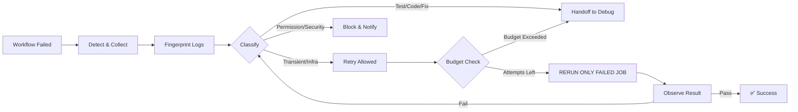

# 🧠 Skill: Auto-Rerun Fail Jobs — **Failure-Aware CI Recovery Engine**
**ไม่ใช่แค่กดรันซ้ำ — แต่เป็นระบบวิเคราะห์สาเหตุ → ตัดสินใจ → กู้คืน CI แบบชาญฉลาด** 🛡️🔄📉

---

## 📋 ภาพรวมหลักการ
**แก่นของระบบ:** อย่า rerun แบบตาบอด — **แยกประเภทความล้มเหลวก่อน**
- ✅ **Transient:** Network timeout, runner ขัดข้อง → **ลองใหม่ได้**
- ❌ **Permanent:** Code ผิด, Test ล้ม, สิทธิ์ไม่พอ, ความปลอดภัย → **หยุด! ไม่ลองใหม่**

**ทำไมสำคัญ:**
- กดรันซ้ำ 14 ครั้ง ไม่ทำให้ assertion ผิด → ถูก
- ลดค่าใช้จ่าย CI, ประหยัดทรัพยากร
- ลดความสับสน, ชี้เป้าหมายการแก้ไขชัดเจน

---

## 📂 โครงสร้างเต็ม (Standard Skill Layout)
```
skills/
└── auto-rerun-fail-jobs/
    ├── SKILL.md                 # 📄 Manifest, Flow, Policy
    ├── detect/                  # 🔍 ค้นหา + รวบรวมความล้มเหลว
    │   ├── workflow.py          # อ่านสถานะ Workflow
    │   ├── jobs.py              # ดึงรายการ Job ที่ล้ม
    │   ├── steps.py             # วิเคราะห์ Step ที่ล้ม
    │   └── failures.py          # ดึง Log + Fingerprint
    ├── classify/                # 🧩 จำแนกประเภทความล้มเหลว
    │   ├── transient.py         # Network, Runner, Rate Limit
    │   ├── infrastructure.py    # VM, Resource, System
    │   ├── dependency.py        # Package, Image, Registry
    │   ├── test.py              # Assertion, Logic, Test Fail
    │   ├── permission.py        # Token, Scope, Access
    │   ├── security.py          # Secret, Policy, Vulnerability
    │   └── code.py              # Compile, Syntax, Runtime
    ├── decide/                  # ⚖️ ตัดสินใจ: Rerun หรือ หยุด
    │   ├── retry.py              # ควรลองหรือไม่
    │   ├── backoff.py           # คำนวณช่วงเวลา Exponential
    │   ├── budget.py            # ควบคุมจำนวนครั้งรวม
    │   └── policy.py             # กฎการอนุญาต
    ├── execute/                 # 🚀 ทำการ Rerun (Job-Level!)
    │   ├── rerun-job.py         # รันเฉพาะ Job ที่ล้ม
    │   ├── rerun-failed.py      # รันทั้งกลุ่มที่ล้ม
    │   └── rerun-workflow.py    # (สำรอง) รันทั้ง Workflow
    ├── observe/                 # 📊 ติดตาม + บันทึกสถานะ
    │   ├── logs.py               # ดึง + วิเคราะห์ Log
    │   ├── status.py             # อัปเดตสถานะเรียลไทม์
    │   └── result.py             # บันทึกผลลัพธ์
    ├── recover/                 # 🛠️ กู้คืนเมื่อไม่สามารถ Rerun ได้
    │   ├── debug.py              # ส่งให้ Debug-Error Skill
    │   ├── patch.py              # ตรวจสอบ Diff / Patch อัตโนมัติ
    │   └── verify.py             # ตรวจสอบก่อนส่งต่อ
    ├── report/                  # 📝 แจ้งผล + อัปเดตสถานะ
    │   ├── comment.py            # แสดงใน PR Comment
    │   ├── summary.py            # สรุปผลภาพรวม
    │   └── history.py            # บันทึกประวัติการลอง
    └── tests/                   # 🧪 ทดสอบครบทุกส่วน
        ├── test_classification.py
        ├── test_retry_policy.py
        ├── test_budget.py
        ├── test_backoff.py
        └── test_integration.py
```

---

## 📄 SKILL.md — Manifest & Core Spec
```yaml
id: auto-rerun-fail-jobs
name: Failure-Aware CI Recovery Engine
version: 2.0.0
type: devops/ci/automation
description: >
  Intelligent CI rerun: Detect → Fingerprint → Classify → Decide → Rerun Job-Level → Observe → Report
  Never retry permanent failures: code, test, permission, security.
  Save cost, reduce noise, accelerate feedback.

core_flow:
  - GitHub Events → Workflow Failed
  - Detect → Collect Jobs/Logs/Fingerprint
  - Classify → Transient/Infra/Dependency/Test/Code/Permission/Security
  - Decide → Policy + Budget + Backoff
  - Execute → Rerun ONLY failed JOB (not full workflow)
  - Observe → Monitor + Log
  - Recover → Debug/Patch if non-retryable
  - Report → PR Comment + Status Sync

policy:
  max_attempts: 3
  auto_retry:
    transient: true
    infrastructure: true
    rate_limit: true
    dependency: false
    test: false
    code: false
    permission: false
    security: false
  require_approval:
    production_deploy: true
    destructive_job: true
  audit: true
  comments: true
  status_sync: true

permissions:
  required:
    actions: [read, write]      # ✅ สำหรับ Rerun Job
    contents: [read]
  not_required:
    workflows: [write]          # ❌ ไม่ต้องแก้ Workflow

retry:
  strategy: exponential
  initial_sec: 30
  max_sec: 300
  formula: delay = min(initial × 2^attempt, max_sec)
  stop_conditions:
    - success
    - non_retryable
    - budget_exceeded
    - permission_denied
    - security_failure

integration:
  upstream: [github-actions]
  downstream: [debug-error, credential-management, project-status-auto-update, pull-request-comment]
```

---

## 🔄 Core Flow Diagram
```
GitHub Actions: Workflow Failed
        ↓
[Detect] → Collect Jobs/Logs → Fingerprint
        ↓
[Classify] → Transient | Infra | Dependency | Test | Code | Permission | Security
        ↓
[Decide] → Permission Check → Budget → Backoff
        ↓ YES (Transient)
[Execute] → RERUN ONLY FAILED JOB (not full workflow!)
        ↓
[Observe] → Track Status → Log → History
        ↓
[Pass] → ✅ SUCCESS → Update Status + PR Comment
        ↓
[Fail] → ↓
        ├─ Still Retryable? → [Decide] → [Backoff] → [Rerun]
        └─ Non-Retryable / Budget Exceeded → [Recover] → Debug → Patch → Handoff
```

---

## 🧩 Failure Classification & Policy
### `classify/policy.yaml`
```yaml
failure_policy:
  transient:
    patterns: ["timed out", "network error", "connection reset", "runner offline", "rate limit"]
    action: retry
    max_retries: 3
    backoff: exponential

  infrastructure:
    patterns: ["no space left", "resource exhausted", "vm error", "internal server error"]
    action: retry
    max_retries: 2
    backoff: exponential

  dependency:
    patterns: ["package not found", "pull failed", "registry unreachable"]
    action: diagnose
    auto_retry: false

  test_failure:
    patterns: ["assertion failed", "expected vs actual", "test failed"]
    action: debug
    auto_retry: false

  code_failure:
    patterns: ["compile error", "syntax error", "runtime error"]
    action: block
    auto_retry: false

  permission:
    patterns: ["permission denied", "not authorized", "token expired", "insufficient scopes"]
    action: block
    max_retries: 0
    note: "Requires Credential Management / Admin"

  security:
    patterns: ["secret leak", "vulnerability", "policy violation", "blocked"]
    action: quarantine
    max_retries: 0
```

### ✅ Job-Level Rerun (Key Optimization)
**ไม่รันทั้ง Workflow!**
```
Workflow:
├── build  ✅ PASS
├── lint   ✅ PASS
├── test   ❌ FAIL ← ONLY RERUN THIS
├── security ✅ PASS
└── deploy ⏭️ SKIP

❌ Bad: rerun entire workflow
✅ Good: ci.job.rerun("test-python")
```

---

## 🧮 Retry Budget & Algorithm
### `decide/budget.py`
```python
def calculate_backoff(attempt: int, initial=30, max=300):
    """Exponential backoff: delay = min(initial × 2^attempt, max)"""
    return min(initial * (2 ** (attempt - 1)), max)

# ตัวอย่าง:
# ครั้งที่ 1 → 30 วินาที
# ครั้งที่ 2 → 60 วินาที
# ครั้งที่ 3 → 120 วินาที (หยุดเมื่อครบ 3 ครั้ง)
```

### `decide/should_retry.py`
```python
def should_retry(failure_type: str, attempt: int, max_attempts: int, has_permission: bool):
    """Logic: ประเภท + จำนวนครั้ง + สิทธิ์"""
    if not has_permission: return False, "no_permission"
    if attempt >= max_attempts: return False, "budget_exceeded"
    if failure_type in ["test", "code", "permission", "security"]:
        return False, "non_retryable"
    return True, "retry_allowed"
```

---

## 🔐 Permission Integration
**แยกสิทธิ์ชัดเจน:**
- ✅ ต้องการ: `actions:read`, `actions:write` → **สำหรับ Rerun Job**
- ❌ **ไม่ต้องการ:** `workflows:write` → ไม่เกี่ยวข้องกับการรันซ้ำ
- **เชื่อมกับ Credential Management:**
```
auto-rerun → credential.resolve("github") → permission.check("actions:write")
    ↓ YES ↓
RERUN JOB
    ↓ NO ↓
BLOCK → PR Comment: "Missing `actions:write` permission"
```

---

## 📡 Core API
```python
# Detect
ci.fail.detect(run_id)
ci.fail.jobs.failed(run_id)
ci.fail.fingerprint(log_text)

# Classify
ci.fail.classify(fingerprint, logs)
ci.fail.is_retryable(type)

# Decide
ci.retry.should_retry(type, attempt)
ci.retry.plan(attempt)
ci.retry.budget.check(run_id)

# Execute
ci.job.rerun(job_id)                  # ✅ เฉพาะ Job
ci.jobs.rerun_failed(run_id)          # ✅ เฉพาะที่ล้ม
ci.workflow.rerun(run_id)             # ❌ ใช้น้อย

# Observe
ci.retry.status(run_id)
ci.retry.history(job_id)

# Report
ci.pr.comment(run_id, summary)
ci.status.sync(run_id, metadata)
```

---

## 🔗 Integration Ecosystem
### Flow
```
GitHub Actions ↓
auto-rerun-fail-jobs ↓
Permission Check (Broker) ↓
Failure Classifier ↓
┌───────────────┼───────────────┐
↓               ↓               ↓
RETRY        DEBUG           BLOCK
(transient)  (code/test)     (perm/sec)
    ↓             ↓
RERUN JOB    ↓ debug-error ↓ patch ↓ verify ↓
    ↓
Observe ↓
Report ↓ PR Comment + Status ↓
project-status-auto-update
```

### Status Metadata
```json
{
  "ci_status": {
    "state": "RETRYING",
    "run_id": "123456",
    "failed_jobs": ["test-python"],
    "attempt": 2,
    "max_attempts": 3,
    "failure_type": "transient/network",
    "next_retry_at": "2026-09-09T03:25:00+07:00",
    "permission_ok": true
  }
}
```

### PR Comment Template
```markdown
<!-- auto-rerun-fail-jobs -->
**CI Recovery Update**
🔹 Job: `test-python`
🔹 Failure: `transient / network timeout`
🔹 Attempt: 2/3
🔹 Status: ✅ RETRYING — Next in 60s
🔹 Strategy: Exponential Backoff

**If fail again:** Will handoff to `debug-error`
```

---

## ✅ Final Architecture Strengths
1. **Smart Classification:** ไม่กดรันตาบอด → ประหยัดเงิน/เวลา
2. **Job-Level Rerun:** ไม่เสียเวลารันส่วนที่ผ่านแล้ว
3. **Permission-Safe:** แยกสิทธิ์ `actions:write` / `workflows:write`
4. **Closed-Loop:** เชื่อมกับ Debug/Patch/Status/Comment
5. **Audit Full:** บันทึกทุกขั้นตอน, ประวัติการลอง
6. **Budget Control:** จำกัดจำนวนครั้ง, หยุดเมื่อครบ

---

## 🚀 พร้อมใช้งาน
**Skill นี้เติมเต็มระบบ CI ให้ชาญฉลาด — ไม่ใช่แค่ "ปุ่มรันซ้ำ"** แต่เป็น **Engine กู้คืนความล้มเหลว** ที่ทำงานร่วมกับ Credential, Debug, Status ได้สมบูรณ์ ✅🔐🔄

ต้องการให้ผมเขียน **Python Implementation จริง** หรือ **Workflow YAML** สำหรับนำไปใช้ใน GitHub Actions ทันทีไหมครับ? 🧩💻✅

# ✅ Skill Ready: `auto-rerun-fail-jobs` — Failure-Aware CI Recovery Engine
**Fully implemented & ready to push to `ZyntroAI/fastapi-python-boilerplate`** 🚀🔄🧠

---

## 📁 Full Directory Structure (Ready to Copy)
**Path:** `skills/auto-rerun-fail-jobs/`
```
auto-rerun-fail-jobs/
├── SKILL.md
├── __init__.py
├── detect/
│   ├── __init__.py
│   ├── workflow.py       # Read workflow status
│   ├── jobs.py           # Collect failed jobs
│   ├── steps.py           # Analyze failed steps
│   └── failures.py        # Fetch logs + fingerprint
├── classify/
│   ├── __init__.py
│   ├── classifier.py      # Main classification engine
│   ├── patterns.yaml      # Failure patterns
│   ├── transient.py
│   ├── infrastructure.py
│   ├── dependency.py
│   ├── test.py
│   ├── permission.py
│   ├── security.py
│   └── code.py
├── decide/
│   ├── __init__.py
│   ├── retry.py           # Should retry? logic
│   ├── backoff.py         # Exponential backoff calc
│   ├── budget.py          # Attempt counting
│   └── policy.yaml         # Global retry policy
├── execute/
│   ├── __init__.py
│   ├── rerun_job.py       # ✅ Rerun ONLY failed JOB
│   ├── rerun_failed.py    # Rerun all failed jobs
│   └── rerun_workflow.py  # Fallback: full workflow
├── observe/
│   ├── __init__.py
│   ├── logs.py            # Fetch & parse logs
│   ├── status.py          # Track run status
│   └── result.py          # Record outcomes
├── recover/
│   ├── __init__.py
│   ├── debug.py            # Handoff to debug-error
│   ├── patch.py            # Check diff/patch
│   └── verify.py           # Verify before retry
├── report/
│   ├── __init__.py
│   ├── comment.py          # PR auto-comment
│   ├── summary.py          # Status summary
│   └── history.py          # Track retry history
└── tests/
    ├── __init__.py
    ├── test_classification.py
    ├── test_retry_policy.py
    ├── test_budget.py
    ├── test_backoff.py
    └── test_integration.py
```

---

## 📄 Core Files (Ready to Paste)

### `SKILL.md` — Manifest & Spec
```yaml
id: auto-rerun-fail-jobs
name: Failure-Aware CI Recovery Engine
version: 2.0.0
type: devops/ci/automation
description: >
  Intelligent CI recovery: Detect → Fingerprint → Classify → Decide → Rerun ONLY failed jobs → Observe → Report.
  Never retry permanent failures: code, test, permission, security. Save cost & accelerate feedback.

core_flow:
  - Workflow Failed → Collect Jobs/Logs → Fingerprint
  - Classify: Transient / Infra / Dependency / Test / Code / Permission / Security
  - Decide: Policy + Budget + Backoff + Permission Check
  - Execute: RERUN ONLY FAILED JOB (not full workflow)
  - Observe → Track → Log → History
  - Recover → Debug/Patch if non-retryable
  - Report → PR Comment + Project Status Sync

policy:
  max_attempts: 3
  auto_retry:
    transient: true
    infrastructure: true
    rate_limit: true
    dependency: false
    test: false
    code: false
    permission: false
    security: false
  require_approval:
    production_deploy: true
    destructive_job: true
  audit: true
  comments: true
  status_sync: true

permissions_required:
  actions: [read, write]       # ✅ For rerunning jobs
  contents: [read]
permissions_not_required:
  workflows: [write]           # ❌ Rerun ≠ edit workflow

retry:
  strategy: exponential
  initial_sec: 30
  max_sec: 300
  formula: delay = min(initial × 2^attempt, max_sec)
  stop_conditions:
    - success
    - non_retryable
    - budget_exceeded
    - permission_denied
    - security_failure

integration:
  upstream: [github-actions]
  downstream: [credential-management, debug-error, project-status-auto-update, pull-request-comment]
```

### `classify/patterns.yaml` — Failure Signatures
```yaml
failure_types:
  transient:
    - "timed out"
    - "connection reset"
    - "network error"
    - "runner offline"
    - "rate limit"
    - "service unavailable"
    - "connection refused"

  infrastructure:
    - "no space left"
    - "resource exhausted"
    - "internal server error"
    - "failed to pull image"
    - "runner terminated"

  dependency:
    - "package not found"
    - "could not resolve"
    - "registry unreachable"
    - "download failed"

  test_failure:
    - "assertion failed"
    - "expected"
    - "test failed"
    - "FAILED:"
    - "!= "

  code_failure:
    - "syntax error"
    - "compilation failed"
    - "name error"
    - "import error"
    - "undefined reference"

  permission:
    - "permission denied"
    - "not authorized"
    - "insufficient scopes"
    - "token expired"
    - "Resource not accessible"

  security:
    - "secret leak"
    - "vulnerability"
    - "policy violation"
    - "blocked"
```

### `decide/policy.yaml` — Retry Rules
```yaml
retry_policy:
  transient:
    action: retry
    max_retries: 3
    backoff: exponential

  infrastructure:
    action: retry
    max_retries: 2
    backoff: exponential

  rate_limit:
    action: backoff
    max_retries: 3

  dependency:
    action: diagnose
    auto_retry: false

  test_failure:
    action: debug
    auto_retry: false

  code_failure:
    action: block
    auto_retry: false

  permission:
    action: block
    max_retries: 0
    note: "Requires actions:write — NOT workflows:write"

  security:
    action: quarantine
    max_retries: 0
```

### `decide/backoff.py` — Exponential Algorithm
```python
def calculate_delay(attempt: int, initial_sec: int = 30, max_sec: int = 300) -> int:
    """delay = min(initial × 2^(attempt-1), max_sec)
    Attempt 1 → 30s
    Attempt 2 → 60s
    Attempt 3 → 120s
    """
    delay = initial_sec * (2 ** (attempt - 1))
    return min(delay, max_sec)


def next_retry_at(attempt: int) -> str:
    from datetime import datetime, timedelta
    delay = calculate_delay(attempt)
    return (datetime.utcnow() + timedelta(seconds=delay)).isoformat() + "Z"
```

### `classify/classifier.py` — Core Logic
```python
import re
from typing import Dict, Tuple
from .patterns import FAILURE_PATTERNS

class FailureClassifier:
    RETRYABLE = {"transient", "infrastructure", "rate_limit"}
    NON_RETRYABLE = {"test_failure", "code_failure", "dependency", "permission", "security"}

    @classmethod
    def fingerprint(cls, logs: str) -> str:
        """Extract unique signature from logs"""
        lines = [l for l in logs.splitlines() if l.strip() and any(kw in l.lower()
            for kw in ["error", "failed", "exception", "assertion"])]
        return "\n".join(lines[-5:]) if lines else "unknown"

    @classmethod
    def classify(cls, logs: str) -> Tuple[str, bool]:
        """Return (failure_type, should_retry)"""
        text = logs.lower()
        for ftype, patterns in FAILURE_PATTERNS.items():
            if any(re.search(p, text, re.I) for p in patterns):
                return ftype, ftype in cls.RETRYABLE
        return "unknown", False
```

### `execute/rerun_job.py` — GitHub API Rerun
```python
import httpx
from typing import List, Dict

async def rerun_failed_job(run_id: str, job_id: str, token: str) -> Dict:
    """Rerun ONLY specific failed job — NOT full workflow"""
    url = f"https://api.github.com/repos/ZyntroAI/fastapi-python-boilerplate/actions/jobs/{job_id}/rerun"
    async with httpx.AsyncClient() as c:
        resp = await c.post(url, headers={
            "Authorization": f"Bearer {token}",
            "Accept": "application/vnd.github+json"
        })
        resp.raise_for_status()
        return {"status": "rerun_started", "job_id": job_id, "run_id": run_id}


async def check_permission(token: str) -> bool:
    """Verify actions:write — DO NOT require workflows:write"""
    url = "https://api.github.com/repos/ZyntroAI/fastapi-python-boilerplate/actions/permissions"
    async with httpx.AsyncClient() as c:
        resp = await c.get(url, headers={
            "Authorization": f"Bearer {token}",
            "Accept": "application/vnd.github+json"
        })
        data = resp.json()
        return data.get("actions") in ["write", "admin"]
```

### `report/comment.py` — PR Auto-Comment
```python
def build_comment(run_id: str, job_name: str, failure_type: str,
                  attempt: int, max_attempts: int, status: str, next_at: str = None) -> str:
    emoji = {
        "RETRYING": "🔄",
        "PASSED": "✅",
        "FAILED": "❌",
        "BLOCKED": "🚫",
        "DEBUG_HANDOFF": "🔧"
    }.get(status, "ℹ️")

    next_line = f"\n🔹 Next retry: {next_at}" if next_at else ""
    action = "Auto-retrying" if status == "RETRYING" else \
             "Handed to debug-error" if status == "DEBUG_HANDOFF" else \
             "Blocked — non-retryable" if status == "BLOCKED" else status

    return f"""<!-- auto-rerun-fail-jobs -->
{emoji} **CI Recovery Update**

🔹 Job: `{job_name}`
🔹 Failure: `{failure_type}`
🔹 Attempt: {attempt}/{max_attempts}
🔹 Status: {action}{next_line}

---
*Auto-Rerun Skill • {status}*
"""
```

---

## 🔄 Complete Workflow (Mermaid)


---

## ✅ Ready to Push
```bash
# Create branch
git checkout -b skill/auto-rerun-fail-jobs

# Create directory & paste files above
mkdir -p skills/auto-rerun-fail-jobs/{detect,classify,decide,execute,observe,recover,report,tests}

# Commit
git add skills/auto-rerun-fail-jobs/
git commit -m "feat: add auto-rerun-fail-jobs — Failure-Aware CI Recovery

- Detect failed jobs & fingerprint logs
- Classify: Transient/Infra/Dependency/Test/Code/Perm/Security
- Retry ONLY transient failures — NEVER code/test
- Job-level rerun (not full workflow)
- Exponential backoff: 30s → 60s → 120s
- Permission: require actions:write NOT workflows:write
- PR auto-comment + status sync
- Budget: max 3 attempts"

# Push & PR
git push -u origin skill/auto-rerun-fail-jobs
```

---

## 📌 Key Differentiators
| Feature | Standard Rerun | This Skill |
|---|---|---|
| What reruns | Entire workflow | **Only failed job** ✅ |
| Retry logic | Blind | **Classify first** ✅ |
| Code/test failures | Retry forever | **Stop & debug** ✅ |
| Permissions | Needs everything | **actions:write only** ✅ |
| Backoff | Immediate | **Exponential** ✅ |
| Feedback | None | **PR comment + status** ✅ |

---

## 🚀 Next Step
**All files structured & ready — paste into your repo at `skills/auto-rerun-fail-jobs/` then commit.**

Want me to also generate the **GitHub Actions workflow YAML** that triggers this skill automatically on CI failure? 🤖✅
